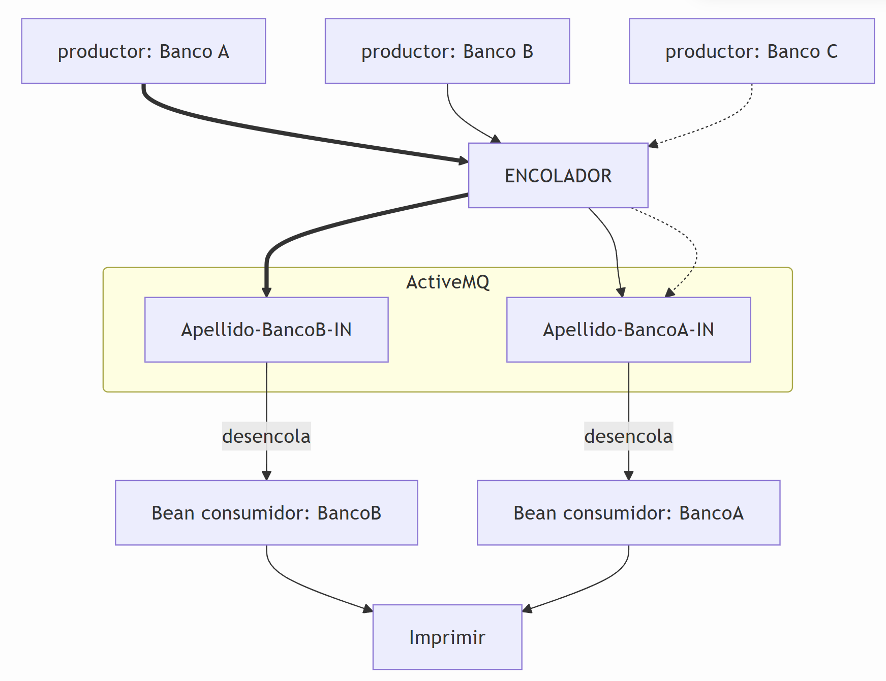

# Proyecto 1

**Forma de entrega:**  
Subir al Canvas el link al repositorio GitHub.

## Objetivo

Simular las interconexiones del sistema de transferencias electrónicas SIPAP, mediante timer y colas de mensajes.

## Requerimientos

- Crear un generador de mensajes de **transferencia** en formato JSON.  
  Los datos de la transferencia deben ser:  
  - `cuenta`
  - `monto`
  - `banco_origen`
  - `banco_destino`

  Esto se debe simular mediante un timer, que genere periódicamente un JSON, por ejemplo:

  ```json
  { "cuenta": "123456", "monto": 500000, "banco_origen": "ATLAS", "banco_destino": "ITAU" }
  ```

  Cada mensaje JSON debe ser generado seleccionando como banco origen y destino: ITAU, ATLAS, FAMILIAR.

  El número de cuenta y monto también deben ser aleatorios entre 1000 y 5000.

- Procesar la petición enviando el mensaje JSON a una cola ActiveMQ con nombre constante.  
  El nombre de la cola debe ser `<apellidoAlumno-ITAU-IN>`.

  Ejemplo: "morales-ITAU-IN"

  Los nombres de las colas deben terminar con el sufijo "-IN" para indicar que es una cola de entrada de cada banco para las transacciones pendientes.

- Programar un consumidor Bean de la cola MQ para cada banco, que simule procesamiento de la transacción.

  Se debe imprimir el JSON recibido.

**OBS:** se debe simular al menos 2 bancos.

## Ejemplo

- Banco A quiere transferir al Banco B, envía mensaje JSON vía API, con método POST.
- Banco B transfiere al Banco A, envía mensaje JSON vía API, con método POST.
- Banco C transfiere al Banco A, envía mensaje JSON vía API, con método POST.
- Banco A, lee su cola de mensajes y procesa (consumidor Banco A).
- Banco B, lee su cola de mensajes y procesa (consumidor Banco B).

